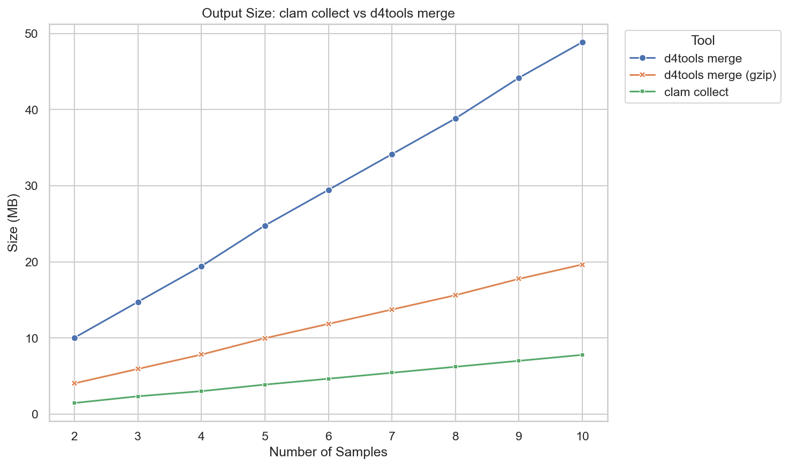

# Benchmarking: clam collect vs d4tools merge

Compares different approaches for combining per-sample depth files into a single multi-sample store:

| Tool                   | Output Format         | Description                                  |
| ---------------------- | --------------------- | -------------------------------------------- |
| `clam collect`         | Zarr (Blosc + Zstd)   | Collects D4 files into a chunked Zarr array  |
| `d4tools merge`        | D4 (uncompressed)     | Merges D4 files into a multi-track D4 file   |
| `d4tools merge + gzip` | D4 (bgzip compressed) | Same as above, followed by bgzip compression |

The benchmark measures:
- **Runtime**: How long each tool takes as sample count increases (2-10 samples)
- **Output size**: Resulting file/directory size in MB
- **Thread scaling**: `clam collect` is tested with 1, 2, 4, and 8 threads (`d4tools merge` does not support multithreading)

## System

- **CPU**: Apple M2 Pro (10 cores: 6 performance, 4 efficiency)
- **Memory**: 32 GB
- **Storage**: 1TB Apple SSD AP1024Z (NVMe, Apple Fabric)

## Setup

Simulates 10 samples of paired-end reads (~10x coverage) from E. coli, converts to D4 format, then benchmarks merging 2-10 samples.

## Usage

```bash
cd benches
pixi run snakemake -s workflow/Snakefile --cores 8 --resources io_heavy=1
```

The `io_heavy=1` resource ensures benchmarked rules run sequentially to avoid I/O contention.

## Results

### Runtime


### Output Size



## TODO

- Add downstream analysis (sum, mean, etc.) benchmarks using D4 or Zarr (with Dask)
